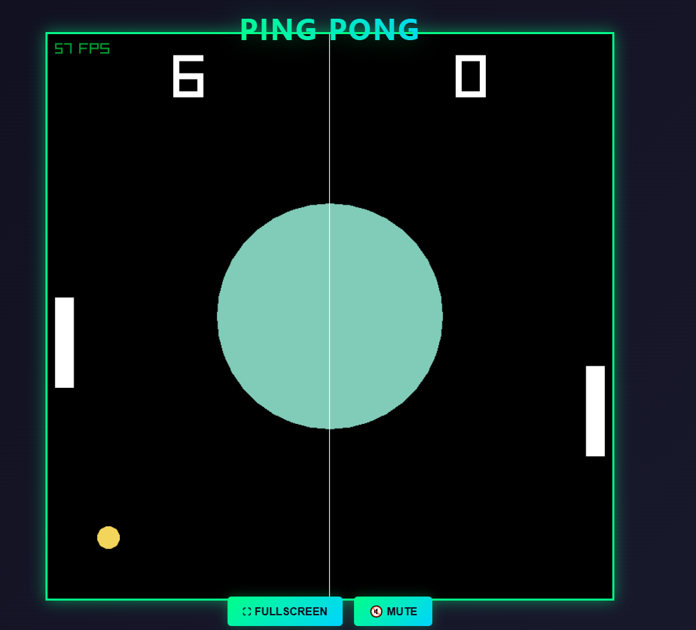

# PingPongCPP

A simple **Ping Pong game** written in **C++** using **Raylib**.

This project started from the  
[Raylib‑CPP Starter Template](https://github.com/educ8s/Raylib-CPP-Starter-Template-for-VSCODE-V2s)  
and demonstrates basic game logic and rendering in C++.:contentReference[oaicite:2]{index=2}

---

## 📌 Features

- Classic 2‑player Pong game
- Simple controls and gameplay
- Built with Raylib C++ bindings

---

## 🛠️ Requirements

Before building, make sure you have:

- A C++ compiler (supporting C++11 or above)
- **Raylib** library installed
- Make or other build tools

> For Raylib install instructions, see: https://www.raylib.com/  

---

## 🚀 Build & Run

Clone the repo:

```bash
git clone https://github.com/devprajwolgotnochill-commits/pingpongcpp.git
cd pingpongcpp



